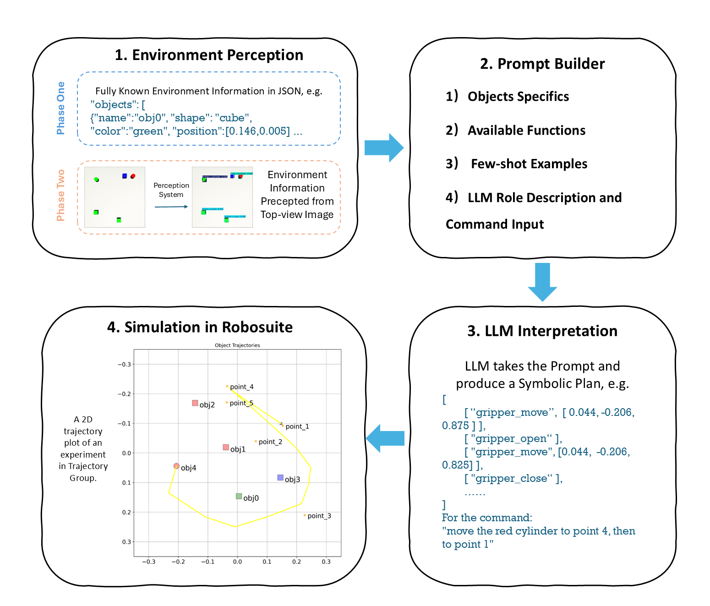
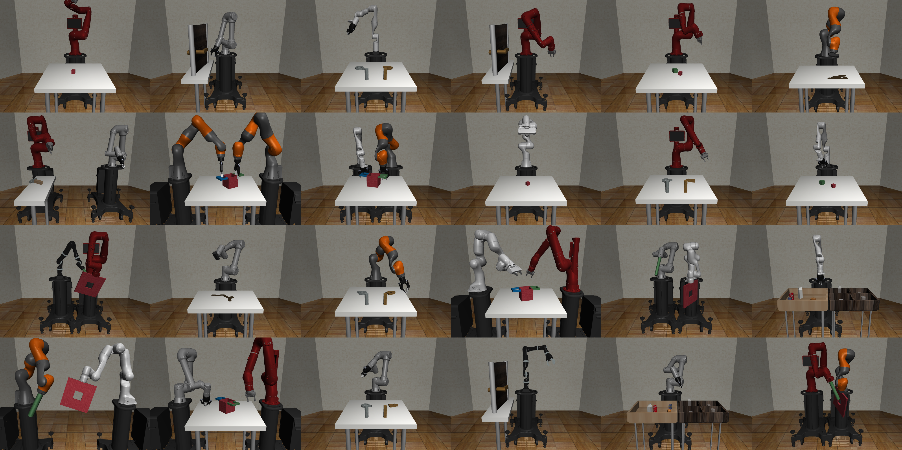

# Jingyang Liu Dissertation - Natural Language Instructed Robotic Arm

<figure>
  
  <figcaption>The schematic diagram of the 2-phase working pipeline. (1) The key difference between phase 2 and phase 1 is that the input is changed from a fully-defined prompt to a top-view image. (2) The predefined or CNN recognised objects' specifics are merged in the prompt building with available functions, few-shot examples, and the natural language command. (3) The LLM's capability is used to interpret the command based on the given environment and functions to produce a symbolic plan which is composed of the fundamental robot skills. (4) The generated symbolic plan is parsed and executed by the system's skill execution module. The end effector trajectory of an example task --- \textit{``trajectory move the red cylinder to point 4, then to point 1''}</figcaption>
</figure>

This software package is built on top of the [Robosuite](https://robosuite.ai) framework.

All personal development code is located in the `myCode/` directory.

---

## Quick Start

### 0) Create a conda env
```bash
conda create -n myenv python=3.10 -y
conda activate myenv
```
### 1) Install robosuite (follow the official docs)
If you have the repo locally:
```bash
cd robosuite
pip install -e .
```
Otherwise, the official guide recommends [Robosuite Github Repo](https://github.com/ARISE-Initiative/robosuite)
```bash
pip install robosuite # or follow their source install instructions
```
### 2) Install my repo’s requirements
```bash
pip install -r myCode/requirements.txt
```
### 3) Add the local robosuite/ folder to your Python path
(Only needed if you’re using a local clone rather than the PyPI package.)
```bash
# From the repository root (which contains the robosuite/ folder):
export PYTHONPATH="$PWD:$PYTHONPATH"
# On Windows PowerShell:
# $env:PYTHONPATH = "$PWD;$env:PYTHONPATH"
```
### 4) Change to the app directory
```bash
cd robosuite/myCode/my_planning_app/
```
### 5) Launch the demo server with Uvicorn
```bash
uvicorn app:app --reload
```
Then open the printed local URL (usually http://127.0.0.1:8000/docs) in your browser.

## Repository Structure

- **my_env/**  
  Modified versions of Robosuite’s Panda Lift environment, adapted to the requirements of this dissertation.  
  - `lift_without_default_cube.py`  
  - `multi_object_lift.py`

- **my_planning_app/**  
  Main experiment pipeline.  
  - `app.py`: FastAPI entry point  
  - `experiment_runner.py`: Automates experiment execution  
  - `ambiguous_experiments_runner.py`: Handles ambiguous command experiments  
  - **logs/**: Contains experiment logs. Includes one representative set for each phase (1–3). Each experiment logging has the input prompt; the generated symbolic plan with an explanation; the objects' status at the end of each execution. Repeated runs for error bars and Phase 3 easy/medium variants are omitted for brevity.  
  - **evaluation/**: LLM-assisted evaluation module
   **plots/**: natural language command evaluation plots
   **prompt_engine/**: compositional elements of the experiment pipeline serving for app.py
   **prompts/**: the elementary prompts (shared instructions and few-shot prompt) to build the group-specific prompt
   **trajectory_planning/**: the traditional algorithms, such as random probabilistic map, Dijkstra's algorithm, used in the hybrid trajectory planning

- **yolo_perception/**  
  Perception system trained in YOLO format. Includes training, inference, and evaluation utilities.  
  - `yolo11n.pt`: Pre-trained YOLO checkpoint  
  - `full_tabletop.yaml`, `mini_tabletop.yaml`: Dataset configs  
  - `scripts/`: Training-related code  
  - Results and plots in `plots_2/`, `plots_6_realistic_noise_comparison/`  

- **Other Core Files**  
  - `config_controller.py`: Experiment configuration manager
  - `robot_skillset.py`, `skill_executor.py`: Defines and executes robot skills  
  - ``top_view_randomizer.py`: Top-view camera setup and randomization utilities  
  - `requirements.txt`: Python dependencies  

# robosuite



[**[Homepage]**](https://robosuite.ai/) &ensp; [**[White Paper]**](https://arxiv.org/abs/2009.12293) &ensp; [**[Documentations]**](https://robosuite.ai/docs/overview.html) &ensp; [**[ARISE Initiative]**](https://github.com/ARISE-Initiative)

-------
## Latest Updates

- [10/28/2024] **v1.5**: Added support for diverse robot embodiments (including humanoids), custom robot composition, composite controllers (including whole body controllers), more teleoperation devices, photo-realistic rendering. [[release notes]](https://github.com/ARISE-Initiative/robosuite/releases/tag/v1.5.0) [[documentation]](http://robosuite.ai/docs/overview.html)

- [11/15/2022] **v1.4**: Backend migration to DeepMind's official [MuJoCo Python binding](https://github.com/deepmind/mujoco), robot textures, and bug fixes :robot: [[release notes]](https://github.com/ARISE-Initiative/robosuite/releases/tag/v1.4.0) [[documentation]](http://robosuite.ai/docs/v1.4/)

- [10/19/2021] **v1.3**: Ray tracing and physically based rendering tools :sparkles: and access to additional vision modalities 🎥 [[video spotlight]](https://www.youtube.com/watch?v=2xesly6JrQ8) [[release notes]](https://github.com/ARISE-Initiative/robosuite/releases/tag/v1.3) [[documentation]](http://robosuite.ai/docs/v1.3/)

- [02/17/2021] **v1.2**: Added observable sensor models :eyes: and dynamics randomization :game_die: [[release notes]](https://github.com/ARISE-Initiative/robosuite/releases/tag/v1.2)

- [12/17/2020] **v1.1**: Refactored infrastructure and standardized model classes for much easier environment prototyping :wrench: [[release notes]](https://github.com/ARISE-Initiative/robosuite/releases/tag/v1.1)

-------

**robosuite** is a simulation framework powered by the [MuJoCo](http://mujoco.org/) physics engine for robot learning. It also offers a suite of benchmark environments for reproducible research. The current release (v1.5) features support for diverse robot embodiments (including humanoids), custom robot composition, composite controllers (including whole body controllers), more teleoperation devices, photo-realistic rendering. This project is part of the broader [Advancing Robot Intelligence through Simulated Environments (ARISE) Initiative](https://github.com/ARISE-Initiative), with the aim of lowering the barriers of entry for cutting-edge research at the intersection of AI and Robotics.

Data-driven algorithms, such as reinforcement learning and imitation learning, provide a powerful and generic tool in robotics. These learning paradigms, fueled by new advances in deep learning, have achieved some exciting successes in a variety of robot control problems. However, the challenges of reproducibility and the limited accessibility of robot hardware (especially during a pandemic) have impaired research progress. The overarching goal of **robosuite** is to provide researchers with:

* a standardized set of benchmarking tasks for rigorous evaluation and algorithm development;
* a modular design that offers great flexibility in designing new robot simulation environments;
* a high-quality implementation of robot controllers and off-the-shelf learning algorithms to lower the barriers to entry.

This framework was originally developed in late 2017 by researchers in [Stanford Vision and Learning Lab](http://svl.stanford.edu) (SVL) as an internal tool for robot learning research. Now, it is actively maintained and used for robotics research projects in SVL, the [UT Robot Perception and Learning Lab](http://rpl.cs.utexas.edu) (RPL) and NVIDIA [Generalist Embodied Agent Research Group](https://research.nvidia.com/labs/gear/) (GEAR). We welcome community contributions to this project. For details, please check out our [contributing guidelines](CONTRIBUTING.md).

**Robosuite** offers a modular design of APIs for building new environments, robot embodiments, and robot controllers with procedural generation. We highlight these primary features below:

* **standardized tasks**: a set of standardized manipulation tasks of large diversity and varying complexity and RL benchmarking results for reproducible research;
* **procedural generation**: modular APIs for programmatically creating new environments and new tasks as combinations of robot models, arenas, and parameterized 3D objects. Check out our repo [robosuite_models](https://github.com/ARISE-Initiative/robosuite_models) for extra robot models tailored to robosuite.
* **robot controllers**: a selection of controller types to command the robots, such as joint-space velocity control, inverse kinematics control, operational space control, and whole body control;
* **teleoperation devices**: a selection of teleoperation devices including keyboard, spacemouse and MuJoCo viewer drag-drop;
* **multi-modal sensors**: heterogeneous types of sensory signals, including low-level physical states, RGB cameras, depth maps, and proprioception;
* **human demonstrations**: utilities for collecting human demonstrations, replaying demonstration datasets, and leveraging demonstration data for learning. Check out our sister project [robomimic](https://arise-initiative.github.io/robomimic-web/);
* **photorealistic rendering**: integration with advanced graphics tools that provide real-time photorealistic renderings of simulated scenes, including support for NVIDIA Isaac Sim rendering.

## Citation
Please cite [**robosuite**](https://robosuite.ai) if you use this framework in your publications:
```bibtex
@inproceedings{robosuite2020,
  title={robosuite: A Modular Simulation Framework and Benchmark for Robot Learning},
  author={Yuke Zhu and Josiah Wong and Ajay Mandlekar and Roberto Mart\'{i}n-Mart\'{i}n and Abhishek Joshi and Soroush Nasiriany and Yifeng Zhu and Kevin Lin},
  booktitle={arXiv preprint arXiv:2009.12293},
  year={2020}
}
```
